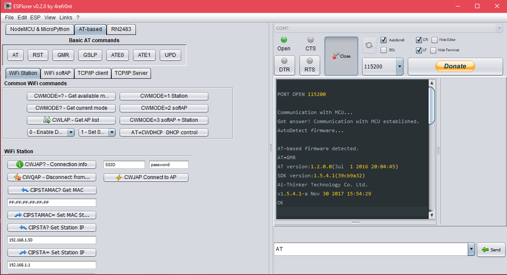

## 工具

### 硬體
- ESP-01 or ESP-01S
- Arduino Mega 2560 or other Arduino boards
- Power Supply (提供穩定電流防止任何錯誤)

### Serial Port Monitor
- ESPlorer
- Realterm

### 韌體燒錄工具
- flash_download_tool_3.9.4

## ESP-01 韌體燒錄流程

### 接線
- ESP-01 Vcc -> Power Supply 3.3V
- ESP-01 CH_PD -> Power Supply 3.3V
- ESP-01 GND -> GND (Power Supply GND & Arduino GND)
- ESP-01 RX -> Arduino RX0
- ESP-01 TX -> Arduino TX0
- ESP-01 GPIO0 -> GND (僅燒錄韌體時要接地)

### 先看韌體燒錄前訊息
**！ 此時 GPIO0 不接地**
- ESPlorer
    1. 開啓 ESPlorer.bat
    2. 畫面右半部上方選擇當前 Arduino Port
    3. 確認 Baud Rate 後點選 Open （一般預設爲 115200 或 9600），若只有以下訊息可能爲 Port 選擇錯誤
        ```
        Communication with MCU...
        ```
        此時已自動輸入指令 `AT+GMR`，正常如下圖顯示，列出韌體 AT 版本、SDK 版本、公司名稱（不見得有）

        

- Realterm
    1. 開啓 Realterm
    2. 在 Display 頁簽左方 Display as 選擇 Ansi-VT100
    3. 點選 Port 頁簽，Baud 設定爲 115200，下拉 Port 選單選擇當前 Arduino Port，觀察程式右下角顯示對應的 Port 和 Baud Rate（若切換 Baud 需點選 Change 按鈕）
    4. 切換到 Send 頁簽，在第一行文字輸入框右方勾選 +CR 和 +LF，輸入 `AT` 並點選 as ASCII 發送，若沒有顯示 OK 代表 Baud 或 Port 選擇錯誤
    5. 輸入指令 `AT+GMR` 觀察韌體細節

        

### 燒錄 ESP-01 韌體
1. 開啓 flash_download_tool_3.9.4.exe
2. 確認以下選項後按下 OK
    - ChipType: Esp8266
    - WorkMode: Develope
3. 在 SPIDownload 頁簽下，點選上半部第一個 ... 按鈕載入韌體，選擇 BAT_AT_V1.7.1.0_1M.bin
4. 右方 @ 欄位爲韌體開始燒錄位置，輸入 0x0
5. 此時先不勾選載入的韌體，確認將 ESP-01 的 GPIO0 接地並確認以下選項後點選 START
    - SPISPEED: 40Mz
    - SPI MODE: DOUT
    - COM: 對應的 Arduino Port
6. 此時 CMD 若沒有馬上出現 "Uploading stub..."，而顯示 "........." 且綠框顯示 "等待上電同步中"，重啓 Power Supply 的 Output 按鈕，高機率能開始動作
7. 此時 DetectedInfo 已出現相關訊息，可開始燒錄韌體

    

8. 勾選先前載入的韌體並按下 START

    燒錄完畢
    

    若燒錄過程出現錯誤訊息，通常韌體並未燒錄進去，不會動到 ESP-01 原先的韌體，可透過上述 Serial Port Monitor 觀察，其他錯誤訊息再自行 Google。依我的經驗若找不到解法可等待一段時間（數分鐘至一天不等），有可能突然好了。

9. 透過 Serial Port Monitor 觀察韌體燒錄狀況

    1. 將 GPIO0 floating
    2. !!! 將 ESP-01 斷電、再送電 !!!
    3. 開啓任一 Serial Port Monitor
    4. 輸入指令 `AT+GMR`
    5. 輸入指令 `AT+CWMODE=1`

        

        若 ESP-01 未重新送電，Serial Port Monitor 會沒有反應

10. 測試 WiFiEspAT.h 是否能在該韌體下使用

    1. 透過 vscode 打開名爲 esp_checkFirmware 的 PlatformIO 專案
    2. 確認正在 esp_checkFirmware Environment 下

        

    3. 接線
        - ESP-01 RX -> Arduino Mega TX1（Hardware Serial 1）
        - ESP-01 TX -> Arduino Mega RX1（Hardware Serial 1）

            僅 Arduino Mega 有 HardwareSerial，若使用其他 Arduino 板則更改 esp_checkFirmware 專案中 /src 底下的 main.cpp，使用 SoftwareSerial 並將 baud rate 設爲 9600（HardwareSerial 無法使用太快的 baud rate），同時要透過 AT 指令將 ESP-01 的 baud rate 設爲 9600。此外 Arduino Mega 只有以下 Pin 腳能當作 HardwareSerial 的 RX：10, 11, 12, 13, 14, 15, 50, 51, 52, 53, A8 (62), A9 (63), A10 (64), A11 (65), A12 (66), A13 (67), A14 (68), A15 (69)

    4. Upload 程式碼至 Arduino 後開啓 Serial Monitor，期望結果如下圖

        

## Reference

1. [ESP8266 series module topic](https://docs.ai-thinker.com/en/esp8266)
2. [ESP8266 SDK released](https://docs.ai-thinker.com/en/esp8266/sdk)
3. [Flash Download Tools | Espressif Systems](https://www.espressif.com/en/support/download/other-tools)
4. [如何为 ESP 系列模组烧录固件](https://docs.ai-thinker.com/esp_download)
5. [ESP-01S ESP8266 - 丢石头百科](https://wiki.diustou.com/cn/ESP-01S_ESP8266)
