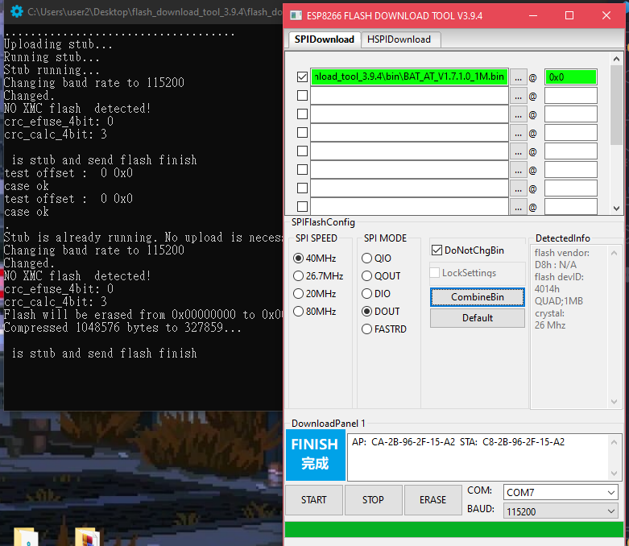

[CH](README.md)

---

## Tools

### Hardware
- ESP-01 or ESP-01S
- Arduino Mega 2560 or other Arduino boards
- Power Supply (Provide stable current to avoid some unkown errors)

### Serial Port Monitor
- ESPlorer
- Realterm

### Firmware Flash Tool
- flash_download_tool_3.9.4

## ESP-01 Firmware Flashing Procedure

### Wiring
- ESP-01 Vcc -> Power Supply 3.3V
- ESP-01 CH_PD -> Power Supply 3.3V
- ESP-01 GND -> GND (Power Supply GND & Arduino GND)
- ESP-01 RX -> Arduino RX0
- ESP-01 TX -> Arduino TX0
- ESP-01 GPIO0 -> GND (only when flashing)

### See ESP-01 Message Before Flashing
**！ Keep GPIO0 floating**
- ESPlorer
    1. Click ESPlorer.bat
    2. Select the corresponding Arduino Port
    3. Check Baud Rate and click Open （default is 115200 or 9600）.
 
       If only the following information is displayed, the baud rate may be selected incorrectly.
        ```
        Communication with MCU...
        
        ```
        At this point, the command `AT+GMR` has been entered automatically, and the normal display as shown below. It lists the firmware AT version, SDK version, and company name (maybe not).

        

- Realterm
    1. Open Realterm
    2. select Ansi-VT100 in the Display tab on the left.
    3. Click the Port tab, set Baud to 115200, scroll down the Port menu to select the current Arduino Port. Observe the corresponding Port and Baud Rate displayed in the lower right corner of the program (if changing Baud, you need to click the Change button).
    4. Switch to Send tab, check +CR and +LF on the right side of the first text input box, type `AT` and click as ASCII send. If "OK" is not displayed, it means Baud or Port is not selected correctly.
    5. Enter the command `AT+GMR` to observe the firmware details.

        

### Flash Firmware
1. Click flash_download_tool_3.9.4.exe
2. Click OK after checking following options
    - ChipType: Esp8266
    - WorkMode: Develope
3. In SPIDownload tab, click the first ... button to load the firmware BAT_AT_V1.7.1.0_1M.bin.
5. The first @ field on the right is the position where the firmware starts to be programmed, enter 0x0.
6. At this time, keep the loaded firmware row unchecked. Make sure the GPIO0 of ESP-01 is grounded, and confirm the following options, then click START.
    - SPISPEED: 40Mz
    - SPI MODE: DOUT
    - COM: Arduino Port
7. If "Uploading stub..." does not appear immediately in terminal, but "..." is displayed and the green box in the flashing tool displays "等待上電同步中". Re-output power from the power supply, and there is a high probability that it will be continue working.
8. At this time, the relevant message has appeared in DetectedInfo, and you can start flashing the firmware.

    

9. Check the previously loaded firmware and click START

    Flashing finish
    
    

    If an error message occurs during the flashing process, usually the firmware has not been flashed in and the original firmware of the ESP-01 will not be affected. You can observe it through the above-mentioned Serial Port Monitor and Google for other error messages. According to my experience, if you can't find a solution, you can wait for a period of time (ranging from a few minutes to a day), and it may get better.

10. Observe firmware flashing status through Serial Port Monitor

    1. Keep GPIO0 floating
    2. !!! Power off and then power on ESP-01 !!!
    3. Open Serial Port Monitor
    4. Enter `AT+GMR`
    5. Enter `AT+CWMODE=1`

        

        If ESP-01 is not powered on again, the Serial Port Monitor will become unresponsive.

11. Test whether WiFiEspAT.h can be used under this firmware

    1. Open the PlatformIO project named esp_checkFirmware through vscode
    2. Confirm that it is in esp_checkFirmware Environment

        

    3. Wiring
        - ESP-01 RX -> Arduino Mega TX1（Hardware Serial 1）
        - ESP-01 TX -> Arduino Mega RX1（Hardware Serial 1）

          Only Arduino Mega has HardwareSerial. If you use other Arduino boards, change main.cpp under /src in the esp_checkFirmware project, use SoftwareSerial and set the baud rate to 9600 (SoftwareSerial cannot use a baud rate that is too fast), and use AT commands to set the baud rate of ESP-01 to 9600. In addition, Arduino Mega only has the following Pins that can be used as SoftwareSerial RX: 10, 11, 12, 13, 14, 15, 50, 51, 52, 53, A8 (62), A9 (63), A10 (64), A11 (65), A12 (66), A13 (67), A14 (68), A15 (69)

    4. Open the Serial Monitor after uploading code to Arduino

        

## Reference

1. [ESP8266 series module topic](https://docs.ai-thinker.com/en/esp8266)
2. [ESP8266 SDK released](https://docs.ai-thinker.com/en/esp8266/sdk)
3. [Flash Download Tools | Espressif Systems](https://www.espressif.com/en/support/download/other-tools)
4. [如何为 ESP 系列模组烧录固件](https://docs.ai-thinker.com/esp_download)
5. [ESP-01S ESP8266 - 丢石头百科](https://wiki.diustou.com/cn/ESP-01S_ESP8266)
